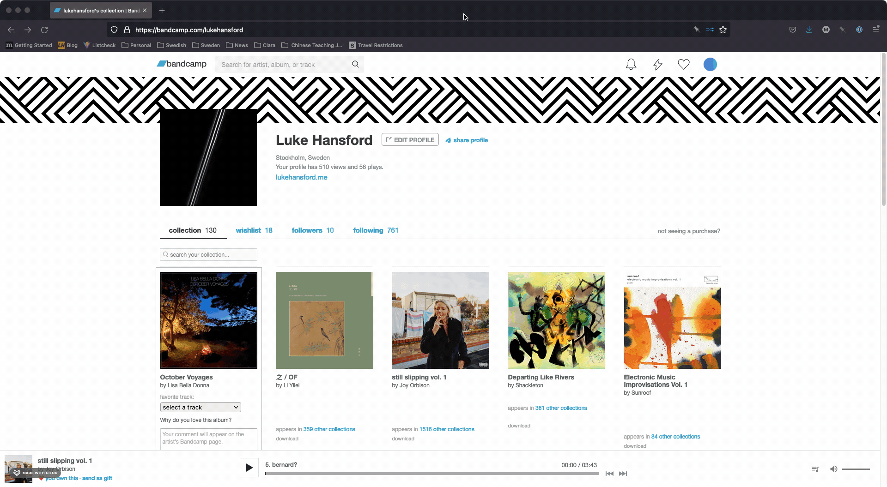

# Bandcamp Shuffle

  

Bandcamp Shuffle is a Firefox add-on that will shuffle collections on Bandcamp pages.

## ⚡ Getting Started

[You can download the add-on for Firefox here](https://addons.mozilla.org/en-US/firefox/addon/bandcamp-shuffle/).

## 📖 Usage

Once the add-on is enabled you should see a button in your Firefox address bar when viewing a
bandcamp.com page. If the page contains a collection of albums it will shuffle the visible albums
(this is only temporary - refreshing the page will reset it to the original order).

In the add-on Preferences you can also enable a mode to first show all albums in the collection
before shuffling. This is a more useful approach, but it's turned off by default as it relies on
a private Bandcamp API and may be unreliable.

## ✍️ Contributing

Feel free to [create an issue](https://github.com/lhansford/bandcamp-shuffle/issues) if you find any
issues or would like to contribute to the project.

## ⚠️ License

Distributed under the MIT License. See LICENSE for more information.
